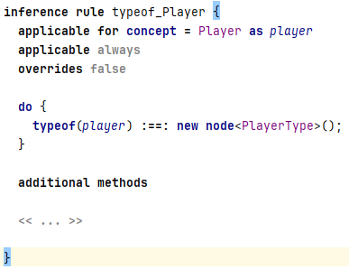
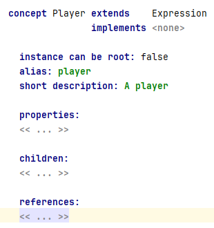
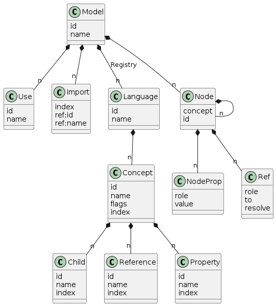

# Pretty printer utility for JetBrains MPS language models

A simple pretty printer. It processes the model files for a language that was defined using JetBrains MPS.

# Intended use

I used the output to write BaseLanguage code that generates a new JetBrains MPS language from a DSL.

The inspiration was this blog post: [Sergej Koščejev: Create a MPS concept declaration programmatically]("https://specificlanguages.com/posts/create-mps-concept-declaration-programmatically/")

The projectional editor of JetBrains MPS is powerful and convenient. Behind the scenes the editor creates models. The pretty printer makes the structure of the models visible.

The nodes in the models contain many references to other nodes. The pretty printer resolves these references.
* It resolves the names of referenced concepts
* For references within your language,the pretty printer creates a unique id. This makes it easier to find the referred node.

# You need
* A copy of the MPS source. The application collects the .mps files to resolve references.
* The location of the model files for your language. The application will generate one output file for each .mps file of your language.
* A Java compiler and maven

Change the following Strings in ProjectPrinter so that they match your setup:
* MPS_SOURCECODE_DIRECTORY
* INPUT_DIRNAME

# Output

The pretty printer will generate a .txt file for every .mps file in INPUT_DIRNAME.

## Excerpt from "Boardgame.typesystem.txt":

```
InferenceRule from jetbrains.mps.lang.typesystem.structure
  name = typeof_Player
  virtualPackage = player
  body = StatementList from jetbrains.mps.baseLanguage.structure
    statement = CreateEquationStatement from jetbrains.mps.lang.typesystem.structure
      rightExpression = NormalTypeClause from jetbrains.mps.lang.typesystem.structure
        normalType = GenericNewExpression from jetbrains.mps.baseLanguage.structure
          creator = SNodeCreator from jetbrains.mps.lang.smodel.structure
            createdType = SNodeType from jetbrains.mps.lang.smodel.structure
              concept -> PlayerType [target id (57) Boardgame.structure]
      leftExpression = NormalTypeClause from jetbrains.mps.lang.typesystem.structure
        normalType = TypeOfExpression from jetbrains.mps.lang.typesystem.structure
          term = ApplicableNodeReference from jetbrains.mps.lang.typesystem.structure
            applicableNode -> player [target id (111)]
  [(111)]applicableNode = ConceptReference from jetbrains.mps.lang.typesystem.structure
    name = player
    concept -> Player [target id (18) Boardgame.structure]
```

The id `(111)` is defined and referenced in this excerpt.

`[target id (18) Boardgame.structure]` references a node that is contained in "Boardgame.structure.txt".


In the editor the inference rule looks like this:




## Excerpt from "Boardgame.structure.txt":

This excerpt shows the concept referenced from the typesystem:

```
[(18)]ConceptDeclaration from jetbrains.mps.lang.structure.structure
  conceptId = 6959912390019845111
  name = Player
  virtualPackage = player
  conceptAlias = player
  conceptShortDescription = A player
  extends -> Expression (jetbrains.mps.baseLanguage.structure)
```

In the editor the concept definition looks like this:



# Limitations

This is a minimal implementation. Currently it does not
* resolve enums or enum members
* handle devkits
* handle .mps files from the source code that are found more than once

All .mps files from the JetBrains MPS source are read, even though only very few are used. Lazy loading would improve that. Another option would be to use multi-threading to read so many files.


# Initial steps in the project

* I used the service on the website [FreeFormatter](https://www.freeformatter.com/xsd-generator.html) with the option "Salami slice" to generate the xsd files from the model files. The classes for the XML parser were generated from the "behavior" aspect model.
* The xsd files were edited:
  * The "value" attribute is mapped to a property called "valueAttribute", to avoid a conflict with the predefined property "value".
 
    ```
    <xs:attribute type="xs:string" name="value" use="optional">
        <xs:annotation>
            <xs:appinfo>
                <jxb:property name="valueAttribute"/>
            </xs:appinfo>
        </xs:annotation>
    </xs:attribute>  
    ```

  * The "node" element was renamed to "MpsNode", to avoid a conflict with the name "node".
    ```
    <xs:element name="node">
      <xs:annotation>
          <xs:appinfo>
              <jxb:class name="MPSNode"/>
          </xs:appinfo>
      </xs:annotation>  
    ```

* I used `xjc` to create the classes from the xsd files. The generated files are stored in `src_gen/java`.


# Reference

## Structure of a JetBrains MPS model file

The following picture shows the simplified structure of a JetBrains MPS model file for a language aspect:

